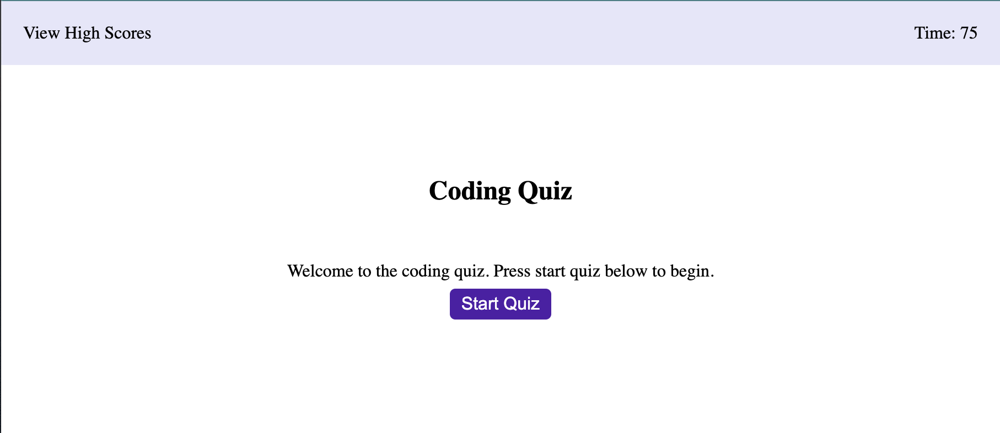

# Coding Quiz

## Description
Create a timed quiz on JavaScript fundamentals that stores high scores so that I can gauge my progress in the bootcamp course.

## Acceptance Criteria
- When the start button is clicked, a timer starts and a question is presented
- When a question is answered, another question is presented
- When a question is answered incorrectly, time is subtracted from the clock
- When all questions are answered or the timer reaches 0, the quiz is over
- When the quiz is over, the user can save their initials and score
### Layout

### Link
[Coding Quiz](https://lexslo.github.io/coding-quiz/)
